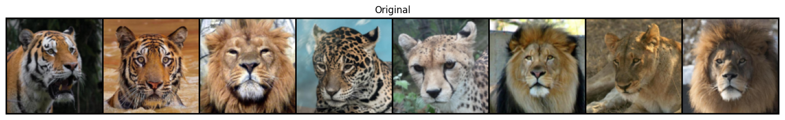
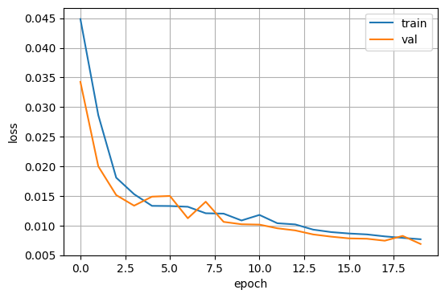
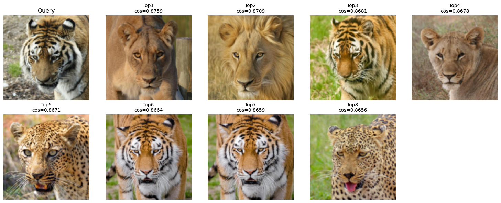

# Autoencoder 기반 Animal Image Retrieval (CBIR)

동물 이미지 데이터셋에 대해 **Convolutional Autoencoder**를 학습하고, 학습된 **Encoder의 latent feature(잠재 특징)**를 이용해 **유사 이미지 검색(Content-Based Image Retrieval, CBIR)** 을 구현한 프로젝트입니다.

---

## 1. 과제 목표

- 동물 이미지 데이터셋으로 **오토인코더(Convolutional Autoencoder)** 를 학습한다.
- 학습된 **Encoder**로 모든 이미지의 **latent feature(임베딩)** 를 추출한다.
- Query 이미지 1장을 기준으로 **가장 유사한 이미지 Top-K** 를 검색한다.
- 검색 결과를 **grid/montage로 시각화**하여 비교한다.

---

## 2. 핵심 개념

### 2.1 Autoencoder란?
Autoencoder는 입력 이미지 `x`를 다시 복원한 `x_hat`이 `x`와 같아지도록 학습하는 **비지도 학습 모델**입니다.

- Encoder: `z = Enc(x)`  
  입력 이미지를 **압축된 벡터(잠재 벡터)** `z`로 변환
- Decoder: `x_hat = Dec(z)`  
  `z`로부터 원본 이미지를 복원
- 손실 함수: `L(x, x_hat)`  
  복원 이미지와 원본 이미지 차이를 최소화 (예: MSE/L1/BCE 등)

Autoencoder가 압축 과정에서 중요한 정보를 `z`에 담도록 강제되므로, `z`는 이미지의 **핵심 시각 특징(feature embedding)** 로 활용할 수 있습니다.

---

### 2.2 CBIR(Content-Based Image Retrieval)이란?
CBIR은 라벨(클래스) 대신 **이미지 내용 기반 특징(feature)** 으로 유사 이미지를 찾는 방식입니다.

이 프로젝트에서는 Autoencoder의 Encoder가 만든 latent embedding을 사용해 검색합니다.

CBIR 파이프라인:

1. 전체 데이터 이미지 → Encoder → 임베딩 `f_i`를 미리 추출해 저장
2. Query 이미지 1장 → Encoder → 임베딩 `f_q` 추출
3. `f_q`와 모든 `f_i` 간 유사도 계산(예: cosine similarity / L2 distance)
4. 유사도 상위 **Top-K** 이미지 반환
5. 결과를 grid로 시각화

---

## 3. 실행 방법 (Colab 기준)

> 이 프로젝트는 Google Colab에서 실행하는 것을 기준으로 작성되었습니다.

### 데이터 준비
- `CBIR.zip` 파일을 Colab 환경에 준비합니다.
- 노트북의 `ZIP_PATH`가 실제 zip 경로를 가리키도록 수정합니다.

예시(노트북 내부):
```python
ZIP_PATH = "/content/drive/MyDrive/.../CBIR.zip"
```

---

## 4. 주요 구현 포인트

### 4.1 학습용 transform과 추출용 transform 분리 (재현성 중요)
- 학습 시에는 일반화를 위해 랜덤 증강(RandomResizedCrop, Flip 등)을 사용할 수 있으나,
- 임베딩 추출(검색용) 시에는 랜덤 요소가 있으면 같은 이미지도 임베딩이 달라져 검색이 불안정해집니다.
- 따라서 검색용 임베딩 추출에는 **고정 transform(Resize/CenterCrop 등)** 만 사용합니다.

### 4.2 유사도 계산 방식
- 보통 cosine similarity 또는 L2 distance를 사용합니다.
- cosine을 쓸 경우 임베딩을 L2 정규화 후 내적으로 계산하는 방식이 흔합니다.

---

## 5. 결과 예시
- Query 이미지 1장 기준으로 유사한 이미지 Top-K가 출력됩니다.

### 5.1 원본 vs 복원 비교 (Autoencoder Reconstruction)
<p align="center">
  
  
</p>

### 5.2 학습 곡선 (Training Curve)
<p align="center">
  
</p>

### 5.3 Top-K Retrieval 결과
<p align="center">
  
</p>
